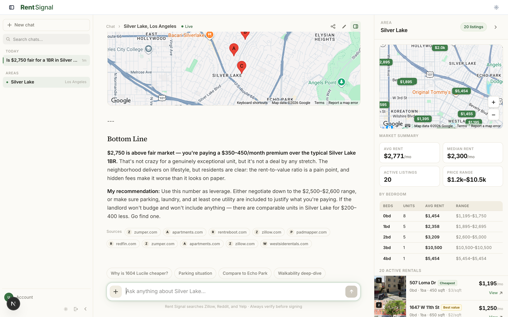
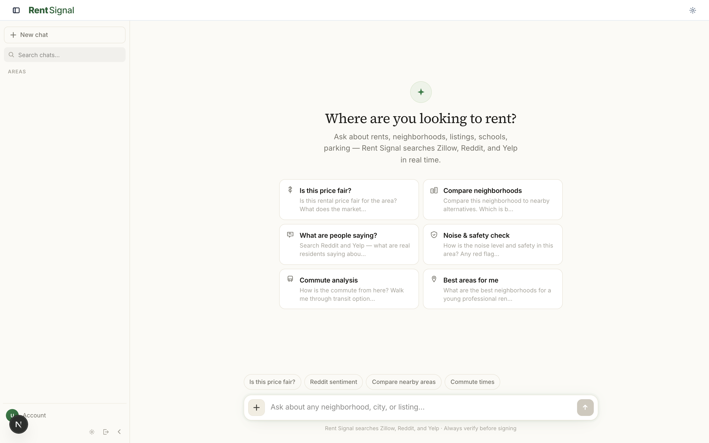
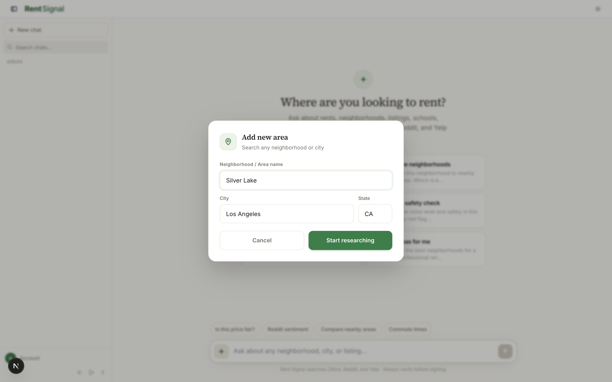
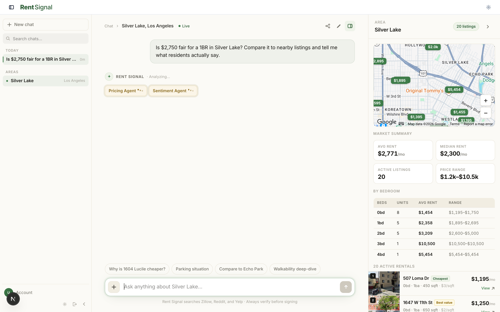

# Rent Signal

**AI rental research that actually does the legwork.** Ask a question about any
neighborhood in the US — *"is $2,750 fair for a 1BR in Silver Lake?"* — and a
team of specialist AI agents researches the live web in parallel, then a lead
analyst synthesizes their reports into one answer with real numbers, charts,
and a map.

Built with Next.js 16, the Anthropic API, and Perplexity search.



---

## The problem

Researching a neighborhood before you rent means opening fifteen tabs: Zillow
for prices, Reddit for what it's actually like, Google Maps for the commute,
crime stats, a walkability score, a news search for whether the market is
moving. Then you hold it all in your head and guess.

Rent Signal collapses that into one question.

---

## What it looks like

**Start with a question, not a search form.**



**Every conversation is scoped to an area** — which is what the listings panel
and the agents' searches key off.



**Then watch the research happen.** The orchestrator picks only the specialists
the question needs — here it routed to Pricing and Sentiment, not all five — and
their status streams live while Rentcast listings and the map populate on the
right.



The finished answer is the screenshot at the top of this README: streamed
markdown with inline charts and maps, and sources behind every claim.

---

## How it works

The interesting part isn't the chat box — it's what happens behind it. A single
question fans out into a five-agent research team, each with live web search,
running concurrently.

```
                        User question
                     "Is Silver Lake worth it?"
                              │
                              ▼
                   ┌──────────────────────┐
                   │  CEO / Orchestrator  │   Claude Haiku 4.5
                   │  tool-based routing  │   picks 1–5 specialists
                   └──────────┬───────────┘
                              │
        ┌──────────┬──────────┼──────────┬──────────┐
        ▼          ▼          ▼          ▼          ▼
   ┌─────────┐┌─────────┐┌─────────┐┌─────────┐┌─────────┐
   │ Pricing ││ Social  ││Neighbor.││ Commute ││Research │   run in PARALLEL
   │  agent  ││  agent  ││  agent  ││  agent  ││  agent  │   each with its own
   └────┬────┘└────┬────┘└────┬────┘└────┬────┘└────┬────┘   system prompt +
        │          │          │          │          │        token budget
        └──────────┴─────┬────┴──────────┴──────────┘
                         │  each calls search_web (Perplexity `sonar-pro`)
                         │  in an agentic tool-use loop until satisfied
                         ▼
              ┌─────────────────────────┐
              │    Lead analyst         │   Claude Sonnet 4.6
              │    synthesis + stream   │   → Haiku 4.5 on overload
              └───────────┬─────────────┘
                          │
                          ▼   Server-Sent Events
              status → routing → agent → chunk → response
                          │
                          ▼
        Streamed markdown, tables, charts, maps, citations
```

### What I think is worth looking at

**Tool-based routing, not keyword matching.** The orchestrator is given a
`select_agents` tool with an enum of the five specialists and forced to call it
(`tool_choice: "any"`). A narrow question spins up one agent; "tell me about
this area" spins up all five. No brittle if/else over keywords — the model's
structured output *is* the routing decision.
→ [`app/api/chat/route.ts`](app/api/chat/route.ts)

**Real agentic loops.** Each specialist runs a `while (true)` tool-use loop:
call the model, if `stop_reason === 'tool_use'` execute the search, feed results
back, repeat until it stops asking. Citations are collected across every hop and
surfaced in the UI.

**Streaming the whole pipeline, not just the tokens.** The response is an SSE
stream with a typed event contract — `status`, `routing`, `agent`, `chunk`,
`response`, `error`. The front end renders each agent's lifecycle
(`pending → running → done`) live, so the user watches the research happen
instead of staring at a spinner. Worth it: the full five-agent run takes real
time, and visible progress makes the wait legible.

**Graceful degradation everywhere.** Anthropic 429/529 responses retry with
backoff, then fall back from Sonnet to Haiku rather than failing the request.
No Rentcast key? The listings endpoint serves geocoded demo listings so the app
is fully explorable with zero paid listing data. No Maps key? Cards render
without photos.
→ [`app/api/listings/route.ts`](app/api/listings/route.ts)

**Rich output, not just prose.** The synthesis prompt teaches the model to emit
fenced ` ```chart ` and ` ```map ` blocks containing JSON. A custom markdown
renderer intercepts those fences and mounts Recharts graphs and Google Maps
panels inline in the chat.
→ [`components/RichMarkdown.tsx`](components/RichMarkdown.tsx)

---

## Stack

| | |
|---|---|
| **Framework** | Next.js 16 (App Router), React 19, TypeScript |
| **AI** | Anthropic API — Claude Sonnet 4.6 + Haiku 4.5, tool use, multi-agent orchestration |
| **Search** | Perplexity `sonar-pro` as the agents' web-search tool |
| **Data** | Rentcast (rental listings), Google Maps (geocoding, Street View) |
| **Auth** | NextAuth v5 — Google OAuth, route protection via proxy |
| **UI** | Recharts, `@vis.gl/react-google-maps`, Tailwind v4 |
| **Transport** | Server-Sent Events over a streaming route handler |

---

## Running it

```bash
git clone https://github.com/LBB2005/rent-signal.git
cd rent-signal
npm install
cp .env.local.example .env.local   # then fill in your keys
npm run dev
```

Open **http://localhost:3002**. You'll land on Google sign-in, then straight
into the chat.

Only `ANTHROPIC_API_KEY`, `PERPLEXITY_API_KEY`, and the three `AUTH_*` values
are required — the listing and map keys are optional and degrade to demo data.
See [`.env.local.example`](.env.local.example) for where to get each one.

---

## Project layout

```
├── app/
│   ├── page.tsx              # → redirects to /chat
│   ├── chat/page.tsx         # the product: state, SSE consumption, persistence
│   ├── login/page.tsx        # Google OAuth sign-in
│   ├── settings/page.tsx
│   └── api/
│       ├── chat/route.ts     # ★ orchestrator, 5 agents, synthesis, SSE stream
│       ├── listings/route.ts # Rentcast + geocoding, demo fallback
│       └── auth/[...nextauth]/route.ts
├── components/
│   ├── ChatArea.tsx          # message list, agent status timeline, composer
│   ├── RightPanel.tsx        # live listings + map for the active area
│   ├── RichMarkdown.tsx      # ★ markdown + inline chart/map fence rendering
│   ├── Sidebar.tsx           # areas & conversation history
│   └── PromptChips.tsx
├── lib/
│   ├── types.ts              # shared Message / Area / AgentRun / Listing types
│   └── storage.ts            # per-user localStorage persistence
├── auth.ts                   # NextAuth config
└── proxy.ts                  # route protection
```

---

## Known limits

Honest about what this is — a working prototype, not a production service:

- Conversations persist to `localStorage` per user, not a database. Clearing
  site data clears history.
- No rate limiting or cost controls on the API routes. A five-agent run makes
  ~10+ model calls.
- No test suite.
- Listing data quality is bounded by Rentcast coverage, which is thin in some
  markets.

---

Built by [Liam Blackshaw-Brown](mailto:liamblackshawbrown@gmail.com).
